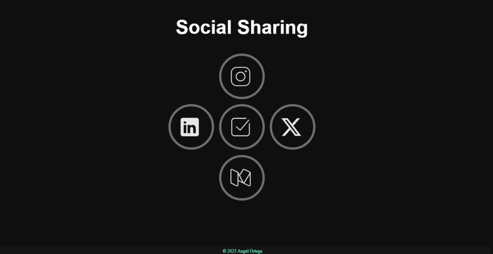

# Social Sharing
This is a simple social sharing effect using HTML, CSS and JavaScript.
## Demo

## Run
1. Clone the repository
2. Open `index.html` in your browser
3. Click on the button to copy the link to clipboard
4. Paste the link in your social media

## Project Specifications
- Create a social sharing effect
- Display active share count
- Button hover effect
- Clicking button copies link to clipboard
## Steps
- Create HTML layout
- Create CSS for basic styles
- Create CSS for button hover effect

## license
this project is under the license
[MIT](https://choosealicense.com/licenses/mit/)